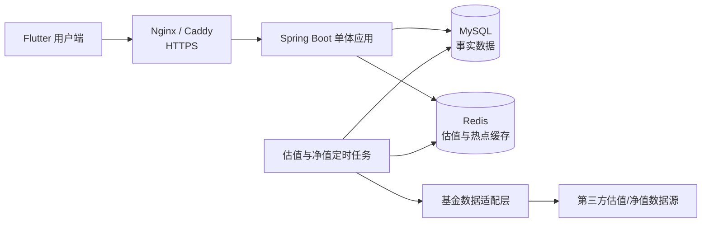

# 基金持仓管理项目规格

> 状态：V1 需求已确认  
> 项目类型：面向学习、面试展示和真实使用的多用户基金持仓管理产品  
> 核心目标：以 Flutter + Spring Boot + MySQL + Redis 完成一条可部署、可验证的全栈交付链路

## 1. 产品定位

本项目用于汇总用户分散在多个平台的基金持仓，记录交易流水，计算持仓与累计收益，并展示盘中实时估值。

产品只提供数据记录与分析：

- 不执行基金交易；
- 不保存支付宝、天天基金等平台的登录凭证；
- 不提供基金推荐、买卖建议或收益承诺；
- 盘中数据必须标记为“预估”，不得冒充正式净值。

V1 按真实多用户产品设计，但主要用于学习和面试展示。

## 2. V1 支持范围

支持人民币计价的境内场外开放式基金：

- 股票型基金；
- 混合型基金；
- 指数型基金。

暂不支持：

- QDII；
- 货币基金；
- 场内 ETF；
- LOF；
- 真实基金交易；
- OCR 截图导入；
- 投资建议、社区、榜单和消息提醒；
- React 管理后台；
- 微服务和 Kubernetes。

## 3. 用户体验原则

普通用户关注金额和收益，不要求理解基金份额。

首页主要展示：

- 累计投入；
- 当前资产；
- 今日预估收益；
- 当前持有收益；
- 累计收益；
- 收益率；
- 连续持有天数；
- 估值更新时间与数据状态。

份额仍作为后端核心计算字段，只在高级信息或交易详情中展示。

## 4. 总体架构



技术选型：

- Flutter 用户端；
- Java 21 + Spring Boot；
- MySQL；
- Redis；
- OpenAPI/Swagger；
- Docker Compose；
- Nginx 或 Caddy；
- 单体架构。

### 4.1 基金参考数据

基金目录、交易日历和正式净值通过
`FundReferenceDataProvider` 端口接入，先幂等同步到 MySQL，业务接口不直连第三方。
个人开发环境可使用东方财富公开页面数据和上交所年度休市安排，Tushare 作为可选适配器；
公开或商业部署必须重新确认数据授权。
申购费率与盘中估值是两条独立数据链路，不能从净值接口推断，也不能互相覆盖。
详细说明见 [基金参考数据接入](fund-reference-data.md)。

## 5. 核心领域模型

### 5.1 用户与平台账户

一个用户可以创建多个平台账户，例如：

- 支付宝；
- 天天基金；
- 银行；
- 手动账户。

同一只基金在不同平台分别记账，展示层可以合并汇总。

```text
用户
├── 支付宝账户
│   └── 基金A持仓
└── 天天基金账户
    └── 基金A持仓
```

底层不能直接把两个平台的持仓合并，因为它们可能具有不同的交易流水、费率、确认状态和成本。

### 5.2 交易流水与当前持仓

交易流水是事实，当前持仓是流水的计算结果：

```text
fund_transaction：发生过什么
fund_position：现在是什么结果
```

V1 支持的流水类型：

- `OPENING_ESTIMATED`：估算期初持仓；
- `BUY`：买入；
- `SELL`：卖出；
- `CASH_DIVIDEND`：现金分红；
- `DIVIDEND_REINVEST`：红利再投资；
- `POSITION_ADJUSTMENT`：持仓校准；
- `REVERSAL`：冲正。

交易流水与当前持仓必须在同一个数据库事务中更新。

## 6. 数据状态

交易或持仓数据至少包含以下状态：

- `PENDING`：等待净值或确认；
- `ESTIMATED`：系统根据金额、时间、净值和默认费率推算；
- `CONFIRMED`：已经通过平台确认数据或人工校准；
- `NEEDS_CALIBRATION`：外部快照与系统结果存在差异；
- `CANCELLED`：用户确认外部交易未完成；
- `REVERSED`：原记录已被冲正。

估算数据必须在界面上明确标识，不能伪装成已确认数据。

## 7. 录入方式

### 7.1 单笔手动录入

用户输入：

- 平台账户；
- 基金代码；
- 购买金额；
- 提交日期，例如 `2026-07-23`；
- 提交时段：`BEFORE_15` 或 `AFTER_15`；
- 可选的平台确认份额和确认日期。

后端负责：

1. 判断是否在交易日 15:00 前提交；
2. 推算有效交易日；
3. 查询对应正式净值；
4. 查询或使用默认申购费率；
5. 计算估算份额；
6. 创建交易流水；
7. 更新当前持仓。

平台折扣、特殊活动、申请撤销和最终确认份额无法完全推算，因此结果在校准前标记为 `ESTIMATED`。

### 7.2 金额式期初持仓

已有持仓可以按金额快速录入：

```text
基金代码
平台账户
持有成本
当前持有金额
开始持有日期
数据时间
```

系统使用录入时对应的正式净值或预估净值推算后台份额，并生成 `OPENING_ESTIMATED`，不伪造历史买入流水。

## 8. JSON 批量导入

JSON 是系统统一导入协议和高级入口，普通用户不需要手写 JSON。未来的表单、CSV、OCR 或 AI 识别结果都可以转换为同一协议。

### 8.1 持仓快照协议

```json
{
  "schemaVersion": "1.0",
  "importType": "POSITION_SNAPSHOT",
  "batchId": "snapshot-20260723-001",
  "account": {
    "name": "我的支付宝",
    "platform": "ALIPAY"
  },
  "snapshotAt": "2026-07-23T14:30:00+08:00",
  "positions": [
    {
      "fundCode": "005827",
      "costAmount": 10000.00,
      "currentAmount": 10326.40,
      "holdingStartDate": "2026-06-01"
    }
  ]
}
```

### 8.2 交易流水协议

```json
{
  "schemaVersion": "1.0",
  "importType": "TRANSACTION_BATCH",
  "batchId": "transactions-20260723-001",
  "account": {
    "name": "我的支付宝",
    "platform": "ALIPAY"
  },
  "transactions": [
    {
      "rowId": "row-001",
      "fundCode": "005827",
      "type": "BUY",
      "amount": 5000.00,
      "submittedDate": "2026-06-01",
      "submittedPeriod": "BEFORE_15"
    }
  ]
}
```

两种协议含义不同，系统不得根据字段猜测导入类型。

### 8.3 导入流程

```text
上传 JSON
→ Schema 校验
→ 业务规则校验
→ 返回逐行预检结果
→ 用户确认
→ 整批事务写入
→ 返回最终结果
```

规则：

- 预检阶段不写数据库；
- 任一写入失败，整个确认批次回滚；
- `batchId` 在用户范围内唯一，防止重复导入；
- 预检结果包含行号、字段、错误码和用户可理解的错误信息；
- 用户可以修复错误后重新预检。

## 9. 快照与流水的时间边界

持仓快照建立时间边界。

例如已经导入 7 月 23 日快照，正常追加的交易必须晚于该时间。早于快照的历史流水不能直接追加，否则会重复计算。

补录快照之前的交易必须进入“历史重建模式”：

```text
导入历史流水
→ 从最早日期重新计算
→ 与既有快照比较
→ 展示差异
→ 用户确认
→ 替代期初快照或生成校准记录
```

后续新快照与系统持仓不一致时，生成 `POSITION_ADJUSTMENT`，不直接删除历史记录。

## 10. 修改与冲正

- `PENDING` 或未确认估算流水可以直接修改或取消；
- `CONFIRMED` 流水不能物理删除；
- 修改已确认流水时，生成 `REVERSAL` 和替代流水；
- 从被修改交易日期开始重新计算持仓和收益；
- 保存操作者、修改原因、关联流水和操作时间。

## 11. 收益计算口径

### 11.1 移动平均成本

V1 使用移动平均成本法：

```text
新份额 = 原份额 + 买入份额
新成本 = 原剩余成本 + 本次实际投入
平均单位成本 = 新成本 ÷ 新份额
```

部分卖出：

```text
移除成本 = 卖出份额 × 卖出前平均单位成本
新剩余成本 = 原剩余成本 - 移除成本
已实现收益 = 卖出净到账金额 - 移除成本
```

### 11.2 当前市值

正式市值：

```text
正式市值 = 持有份额 × 最近正式净值
```

盘中预估市值：

```text
预估市值 = 持有份额 × 盘中预估净值
```

### 11.3 收益

```text
当前持有收益 = 当前市值 - 当前剩余成本

累计收益 =
当前市值
+ 历史卖出净到账金额
+ 现金分红
- 累计实际投入

累计收益 = 当前持有收益 + 已实现收益
```

资产总览以累计收益为主，单只基金卡片以当前持有收益为主。详情页同时展示今日收益、当前持有收益、已实现收益和累计收益。

### 11.4 连续持有天数

从当前仍持有基金的最早一笔确认交易开始计算：

- 加仓和部分卖出不重置；
- 全部清仓时结束当前持仓周期；
- 清仓后重新买入，从新买入确认日重新计算；
- 跨账户汇总时使用当前所有持仓账户中最早的持有日期。

## 12. 盘中实时估值

盘中估值是 V1 核心功能。

系统同时保存：

- `official_nav`：正式净值；
- `estimated_nav`：盘中预估净值；
- 数据来源；
- 数据时间；
- 抓取时间；
- 是否过期。

页面必须使用“预估收益”“预估净值”或 `≈` 标记。

更新策略：

- 交易时段后端每 60 秒更新活跃基金估值；
- Flutter 每 30 秒查询后端；
- 0～90 秒视为正常；
- 90 秒～3 分钟标记更新延迟；
- 超过 3 分钟视为过期，降级展示最近正式净值；
- 正式净值公布后自动校准并记录估值偏差。

第一版不自研估值算法，使用第三方数据并通过统一适配接口接入：

```java
public interface IntradayValuationProvider {
    List<IntradayValuation> fetchLatest(Set<String> fundCodes);
}
```

学习版已经接入东方财富公开估值列表，并使用 Redis 分页索引避免每分钟全量
抓取。实际商用供应商、授权方式、调用额度和费用仍需单独确认。

## 13. MySQL 与 Redis 边界

MySQL 保存事实数据：

- 用户；
- 平台账户；
- 基金资料；
- 正式净值；
- 交易流水；
- 当前持仓；
- 每日资产快照；
- 导入批次；
- 冲正与校准记录；
- Refresh Token 或其持久化索引。

Redis 只用于加速和短期状态：

- 最新盘中估值；
- 热门基金资料；
- 基金搜索结果；
- 短期幂等结果；
- Refresh Token 或会话状态；
- 定时任务短期协调信息。

Redis 不是交易流水和持仓的唯一存储。Redis 故障时，正式持仓查询仍应可用，只失去实时估值和缓存加速。

## 14. 幂等与并发

幂等约束：

- 单笔操作使用 `requestId`；
- 批量导入使用 `batchId`；
- 建议数据库唯一约束为 `(user_id, request_id)` 和 `(user_id, batch_id)`；
- 重复请求返回第一次处理结果，不重复记账。

并发要求：

- 同一账户、同一基金的持仓更新需要乐观锁版本号或等价并发控制；
- 交易流水插入与持仓更新处于同一事务；
- 重试前必须检查原请求是否已经成功；
- 超时不等于失败，不能盲目重复写入。

## 15. 身份认证与数据隔离

V1 使用：

- 邮箱和密码注册；
- BCrypt 密码哈希；
- 短期 Access Token；
- 长期 Refresh Token；
- Access Token 建议 30 分钟；
- Refresh Token 建议 30 天并支持主动失效。

安全原则：

- 不保存明文密码；
- 不相信客户端传入的 `userId`；
- 用户身份只从已验证登录态获取；
- 所有账户、持仓、流水和导入查询必须附带用户范围条件；
- 用户不能访问、修改或推断其他用户的资产数据；
- 日志不得输出密码、Token 或完整敏感资产明细。

## 16. 部署与运行

V1 最终部署到公网：

- 单台云服务器；
- Docker Compose；
- Spring Boot、MySQL、Redis；
- Nginx 或 Caddy；
- 域名与 HTTPS；
- 不使用 Kubernetes。

运行要求：

- MySQL 和 Redis 不暴露公网端口；
- 密钥通过环境变量或密钥管理提供；
- 开发、测试、生产配置分离；
- 容器异常自动重启；
- Spring Boot 提供健康检查；
- 每日数据库备份；
- 日志包含请求 ID；
- 第三方数据超时不得拖垮持仓主接口。

## 17. V1 完成标准

- [ ] 用户可以注册、登录和刷新 Token。
- [ ] 不同用户的数据严格隔离。
- [ ] 用户可以创建多个平台账户。
- [ ] 用户可以按基金代码、金额和时间录入交易。
- [ ] 支持 `POSITION_SNAPSHOT` JSON 导入。
- [ ] 支持 `TRANSACTION_BATCH` JSON 导入。
- [ ] JSON 导入支持预检、确认、幂等、回滚和错误报告。
- [ ] 支持买入、卖出、现金分红、红利再投资、校准和冲正。
- [ ] 使用移动平均成本计算收益。
- [ ] 展示累计资产、累计收益、持有收益和连续持有天数。
- [ ] 盘中估值每 60 秒更新。
- [ ] Flutter 每 30 秒刷新估值。
- [ ] 估值过期后正确降级。
- [ ] 正式净值公布后完成校准并记录偏差。
- [ ] 重复请求不会重复记账。
- [ ] 事务失败不会产生部分成功。
- [ ] Redis 故障时正式持仓仍可查询。
- [ ] Docker Compose 可以启动完整环境。
- [ ] 公网环境支持 HTTPS、健康检查、日志和备份。
- [ ] 自动化测试覆盖收益、隔离、幂等、事务和估值降级。

## 18. 待调研事实项

以下不是尚未决定的产品需求，而是需要通过真实资料和实验确认的外部事实：

1. 可合法使用的基金基础资料与正式净值来源；
2. 可用的盘中基金估值供应商；
3. 数据授权、费用、调用频率和缓存限制；
4. 各数据源的字段完整性、更新时间和故障表现；
5. 基金交易日历与节假日数据来源；
6. 支持基金范围内的费率和确认规则数据可获得性。

在供应商确定之前，业务层只依赖适配接口，并准备 Mock Provider 供开发和自动化测试使用。

## 19. 推荐实施顺序

1. 建立 Spring Boot、MySQL、Redis 和 Docker Compose 环境；
2. 完成用户注册登录和数据隔离；
3. 完成平台账户与基金资料；
4. 完成手动买入和当前持仓；
5. 完成移动平均成本与收益计算；
6. 完成单笔幂等、事务和并发控制；
7. 完成快照 JSON 的预检与原子导入；
8. 完成交易流水 JSON 与时间边界；
9. 完成卖出、分红、冲正和历史重算；
10. 接入第三方估值适配层与 Redis 缓存；
11. 完成 Flutter 全流程；
12. 补齐测试、日志、备份和公网部署。
